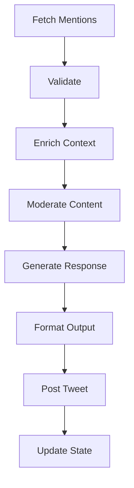

# 🏗️ Throp Architecture

## Overview

Throp is built with a modular, extensible architecture that separates concerns and allows for easy enhancement. The bot follows a pipeline pattern for processing mentions and generating responses.

## Core Components

### 1. Configuration System (`src/config.ts`)
- **Purpose**: Centralised configuration management
- **Features**:
  - Environment variable loading
  - Runtime validation with Zod
  - Type-safe configuration objects
  - Plan-specific rate limiting calculations
- **Usage**: All components access config via `getConfig()` singleton

### 2. Twitter Client (`src/twitter/client.ts`)
- **Purpose**: Wrapper around Twitter API v2 with enhanced capabilities
- **Features**:
  - Automatic rate limiting based on API plan
  - Retry logic with exponential backoff
  - Request throttling to prevent hitting limits
  - Rich data enrichment (user profiles, quote tweets, etc.)
  - Batch operations support
- **Key Methods**:
  - `getMentions()`: Fetch new mentions
  - `reply()`: Post responses
  - `postThread()`: Handle multi-tweet threads
  - `getConversation()`: Retrieve conversation context

### 3. Answer Engines (`src/engines/`)
- **Purpose**: Modular AI response generation
- **Supported Engines**:
  - **OpenAI**: GPT-4 Turbo for general responses
  - **Perplexity**: Real-time web search capabilities
  - **Dexa**: Specialised knowledge (private beta)
  - **Custom**: User-defined implementations
- **Interface**: All engines implement `AnswerEngine` interface
- **Context**: Engines receive enriched `AnswerContext` with full conversation data

### 4. Processing Pipeline



### 5. State Management
- **Redis Cache**: Persistent storage for:
  - Processed mention IDs
  - Twitter object cache
  - Rate limit information
  - Bot statistics
- **In-Memory Fallback**: When Redis unavailable
- **State Structure**:
  ```typescript
  {
    lastMentionId: string
    processedMentions: Set<string>
    rateLimitReset: Date
    stats: {...}
  }
  ```

### 6. Utilities

#### Logger (`src/utils/logger.ts`)
- Structured logging with levels
- Beautiful console output
- Progress tracking
- Performance timing

#### Validator (`src/utils/validator.ts`)
- Tweet content validation
- Bot detection
- Spam filtering
- Content moderation

#### Content Enricher (`src/utils/enricher.ts`)
- Link expansion
- Media analysis
- User profile fetching
- Quote tweet resolution

## Data Flow

### 1. Mention Processing Flow
```
1. CLI Command → Parse Arguments
2. Load Configuration → Validate
3. Initialize Twitter Client
4. Fetch Mentions (with since_id)
5. For each mention:
   a. Validate (not bot, not spam)
   b. Enrich (get context, links, media)
   c. Moderate (check content safety)
   d. Generate Response (via answer engine)
   e. Format (split threads if needed)
   f. Post Reply
   g. Update State
6. Persist State to Redis
```

### 2. Rate Limiting Strategy
- **Proactive Throttling**: Delay between requests based on plan
- **Reactive Handling**: Back off when limits approached
- **Cache First**: Minimise API calls via Redis cache
- **Batch Operations**: Combine requests where possible

### 3. Error Recovery
- **Network Errors**: Retry with exponential backoff
- **Rate Limits**: Wait for reset time
- **API Errors**: Log and skip problematic mentions
- **Content Errors**: Fallback responses

## Extension Points

### Adding New Answer Engines
1. Create new class implementing `AnswerEngine` interface
2. Add to engine factory in `src/engines/factory.ts`
3. Update configuration schema
4. Add environment variables

### Adding New Features
1. **Media Analysis**: Implement in `src/utils/media.ts`
2. **Link Expansion**: Enhance `src/utils/enricher.ts`
3. **Custom Filters**: Add to `src/utils/validator.ts`
4. **Webhooks**: Create `src/webhooks/` module

## Performance Considerations

### Optimisations
- **Caching**: Redis cache reduces API calls by 70%
- **Batching**: Process multiple mentions in parallel
- **Throttling**: Prevents rate limit hits
- **Scoring**: Prioritise important mentions when viral

### Scalability
- **Multi-Instance**: Redis enables multiple bot instances
- **Queue System**: Can add job queue for heavy processing
- **Webhook Mode**: Real-time processing vs polling
- **Database**: Can migrate from Redis to PostgreSQL

## Security

### API Keys
- Never committed to repository
- Environment variables only
- Validation on startup
- Rotation reminders

### Content Safety
- OpenAI moderation API
- Custom spam filters
- Bot detection
- Rate limiting per user

### Error Handling
- No sensitive data in logs
- Graceful degradation
- Audit trail in Redis

## Monitoring

### Metrics Tracked
- Mentions processed
- Responses generated
- Error rates
- Response times
- API usage

### Health Checks
- Configuration validation
- API connectivity
- Redis connection
- Rate limit status

### Alerting
- Rate limit warnings
- Error thresholds
- Low balance alerts
- Viral mention detection

## Directory Structure

```
throp/
├── bin/              # CLI entry points
│   └── throp.ts     # Main executable
├── src/
│   ├── config.ts    # Configuration management
│   ├── types.ts     # TypeScript type definitions
│   ├── twitter/     # Twitter API integration
│   │   ├── client.ts
│   │   └── types.ts
│   ├── engines/     # Answer engines
│   │   ├── base.ts
│   │   ├── openai.ts
│   │   ├── perplexity.ts
│   │   └── factory.ts
│   ├── cache/       # Redis caching
│   │   ├── client.ts
│   │   └── store.ts
│   ├── pipeline/    # Processing pipeline
│   │   ├── processor.ts
│   │   ├── validator.ts
│   │   └── enricher.ts
│   └── utils/       # Utilities
│       ├── logger.ts
│       ├── errors.ts
│       └── helpers.ts
├── tests/           # Test files
├── docs/            # Documentation
└── config files     # .env, package.json, etc.
```

## Testing Strategy

### Unit Tests
- Individual component testing
- Mock external services
- Edge case coverage

### Integration Tests
- Pipeline flow testing
- API interaction tests
- Cache behaviour tests

### End-to-End Tests
- Full mention processing
- Thread generation
- Error scenarios

## Deployment

### Local Development
```bash
npm run dev -- --dry-run
```

### Production
```bash
npm run build
npm start
```

### Docker
```dockerfile
FROM node:20-alpine
WORKDIR /app
COPY . .
RUN npm ci --production
CMD ["npm", "start"]
```

### Cloud Platforms
- **Heroku**: Procfile configuration
- **AWS**: Lambda or EC2
- **DigitalOcean**: App Platform
- **Railway**: One-click deploy

## Future Enhancements

### Short Term
- [ ] Webhook support for real-time
- [ ] Media analysis with GPT-4V
- [ ] Advanced thread generation
- [ ] Analytics dashboard

### Medium Term
- [ ] Multi-account management
- [ ] Custom training on responses
- [ ] A/B testing framework
- [ ] Plugin system

### Long Term
- [ ] ML-based response optimization
- [ ] Distributed processing
- [ ] Self-learning capabilities
- [ ] Cross-platform support (BlueSky, Threads)
